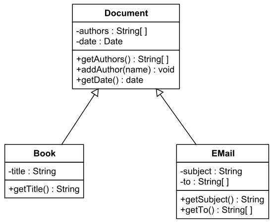

# C/C++ Notes
# Table of Contents
1. Getting Started
2. Types Operators and Expressions
3. Input / Output
4. Control Flow
5. Array and String
6. Function
7. Pointers, References, and Dynamic Allocation
8. Struct
9. Linked list
10. Class and Object	

 ## Getting Started
### Installation
- Download [MSYS2](https://www.msys2.org/)
- Open MSYS2 and copy paste this code line by line into command line
```
pacman -S git man-pages-posix make vim diffutils
```

```
pacman -S mingw-w64-x86_64-gcc
```

```
pacman -S mingw-w64-x86_64-SDL2 mingw-w64-x86_64-SDL2_gfx mingw-w64-x86_64-SDL2_image mingw-w64-x86_64-SDL2_mixer mingw-w64-x86_64-SDL2_net mingw-w64-x86_64-SDL2_ttf
```
- Setup C/C++ path in system environment variable by adding a location where you save the file
-  Download [VScode]([**https://code.visualstudio.com/Download**](https://www.google.com/url?q=https%3A%2F%2Fcode.visualstudio.com%2FDownload&sa=D&sntz=1&usg=AOvVaw0PO-n7XcOtl7KxYeBGyXGH)) to writing code
- In VScode download C/C++ extension for autocomplete syntax

- To compile c/c++ code type these command in your command line
	make sure to be in file directory before complie. 

In C
```
gcc [filename].c -o filename
``` 
In C++
```
g++ [filename].cpp -o filename
```
To run use this command
```
./[filename]
```
 
 
 ## Types Operators and Expressions
 
 ### Types
 - Intergers `int` `short` `long long` `char` `bool`
 - Floating point `float` `double` `long double`
 - characters `char` 

การสร้างตัวแปร
- นํา type ไว้หน้าชื่อตัวแปร
- การตั้งชื่อตัวแปรใน c++ จะตั้งชื่อตัวแปรเป็น type ไม่ได้ และจะมีตัวเลขอยู่ข้างหน้าไม่ได้
- หลักการตั้งชื่อดูได้ตาม [google c++ style guide](https://google.github.io/styleguide/cppguide.html#Naming)
```cpp
int var1, var2 = 0;
char ch;
float f1;
double lf2;

```

Size of each type in Byte
| type             | byte | range                                    | format |
|--------------------|----|---------------------------------------------|-----| 
| char               | 1  | -128 to 127                                 | %c  |
| unsigned char      | 1  | 0 to 255                                    | %c  |
| short              | 2  | -32,768 to 32767                            | %d  |
| unsigned short     | 2  | 0 to 65535                                  | %u  |
| int                | 4  | 2,147,483,648 to 2,147,483,647              | %d  |
| unsigned int       | 4  | 0 to 4,294,967,295                          | %d  |
| float              | 4  | 1.2E-38 to 3.4E+38                          | %f  |
| double             | 8  | 2.3E-308 to 1.7E+308                        | %lf |
| long double        | 10 | 3.4E-4932 to 1.1E+4932                      | %Lf |
| long long          | 8  | -9223372036854775808 to 9223372036854775807 | %ld |
| unsigned long long | 8  | 0 to 18446744073709551615                   | %lu |

 Type casting การเปลี่ยนค่าให้กลายเป็น type ต่าง โดยใส่ `(type)` ไว้ข้างหน้าตัวแปร
```
cout << (int)7.5 << endl;
```
```cpp
// Use type casting to round the number.
int round(float n) {
	return (int)(n + 0.5);
}
```
 ### Operators
**C++ Operators Precedence**
 
  
  ## Input / Output
  จะใช้คําสั่งได้ต้อง Include Libary มาก่อนโดยใน C กับ C++ จะใช้ต่างกันโดย
  In C:
```c
  #include <stdio.h>
  ```
  In C++:
```c++
  #include <iostream> // std::cin, std::cout
  #include <cstdio> // same thing as <stdio.h> in C , printf(), scanf()
  using namespace std; // write need so we don't need to write std:: everytime
  ```
  คําสั่งที่ใช้รับ Input
```
  fgets(char* input, size, stdin); // รับ \n มาด้วย
  gets(char* input) // not safe to use
  scanf(char* format, args); 
  cin >> x;
  getline();
  ```
  คําสั่งที่ใช้ print ออกไปหน้าจอ
```
  printf();
  cout << x;
  ```

## Control flow
### Conditional
**If-Else, Else if**
```
if (condition1) {
    // statements
} else if (condition2) {
    // statements
} else {
    // statements
}
```
Example: โปรแกรมคํานวณหาเกรด
```cpp
#include <iostream>
using namespace std;

int main() {
    int score;
    char grade;
    cin >> score;
    if (score >= 80)
        grade = 'A';
    else if (score >= 75)
        grade = 'B+'
    else if (score >= 70)
        grade = 'B'
    else if (score >= 65)
        grade = 'C+'
    else if (score >= 60)
        grade = 'C'
    else if (score >= 55)
        grade = 'D+'
    else if (score >= 50)
        grade = 'D'
    else
        grade = 'F'

    cout << grade << endl;
}
```
**switch-case**
มีได้หลาย case ถ้าไม่ตรงกับ case ไหนเลยให้ทําคําสั่งใน default
```
switch (var) {
    case 1:
        // statements
	    break;
    case 2:
	    // ..
    default:
        // statements
}
```
Example : โปรแกรมเครื่องคิดเลข
```cpp
#include <iostream>
using namespace std;

int main() {
    int num1, num2, result;
    char op;
    cin >> num1 >> op >> num2;
    switch (op) {
        case '+':
	        result = num1 + num2;
	        break;
	    case '-':
	        result = num1 - num2;
	        break;
        case '*':
	        result = num1 * num2;
            break;
        case '/':
            result = num1 / num2;
            break;
        default:
            result = 0;
            break;
    }
    cout << result << endl;
}
```
### Loops
ข้อดีของลูปคือลดการเขียนโค้ดซํ้าๆ ซึ่งใน C++ ใช้ได้หลายแบบ ดังนี้

**while**
```
while (condition) {
  // statements
}
```
**do-while**
```
do {
  // statements
} while (condition)
```
**for-loop**
```
for (init; condition; end) {
  // statements
}
```
**for-each**
```
for (init : array or vector) {
  // statements
}
```

Example : ใช้ลูปปริ้นสูตรคูณแม่ 12
```cpp
#include <cstdio>

int main() {
    for (int i = 1; i <= 12; i++)
        printf("12 * %d = %d", i, 12 * i);
}
```
Example : ใช้ for each print ค่าใน array
```cpp
#include <iostream>

int main() {
    int arr[5] = {1, 2, 3, 4, 5};
	for (int val : arr) {
		std::cout << val << " ";
	}
	std::cout << "\n";
}
```
Example : ใช้ loop ไปเรื่อยๆจนกว่าผู้ใช้จะสั่งหยุด
```cpp
while (1) {
    cin >> input;
    if (input == -1)
	    break;
	// do whatever you want
}
```


## Array and String
### Array
Array ใช้เก็บข้อมูลประเภทเดียวกันหลายๆตัว
```cpp : Array 1D
int arr[5] = {1, 2, 3, 4, 5}; // index of array start with 0
int zero[10] = {}; // initialize all data to 0
char s[3] = {'a', 'b', 'c'};
```

Array 2D
```cpp
int arr[5][5] = 
{
    {1, 2, 3, 4, 5},
    {6, 7, 8, 9, 0},
    {1, 3, 5, 7 ,9},
    {0, 1, 5, 3, 2},
    {1, 1, 5, 5, 2}

}
```

เวลาจะเรียกใช้ ให้ใช้ nested loop
```cpp
for (int i = 0; i < 5; i++) {
    for (int j = 0; j < 5; j++) {
        cout << arr[i][j] << " ";
    }
    cout << "\n";
}
```

### Array out of bound
สมมุติเรากําหนด array `int arr[100]` แล้วพยายามเรียกหา `arr[101]` `arr[102]` ถ้าเรียกเกินมาจากที่กําหนดนิดหน่อยจะไม่เป็นไร แต่ถ้าเรียกเกินจากที่กําหนดมากไปเช่น `arr[1000]` จะเกิด error
ที่เรียกว่า `Segmentation fault` นั่นคือพยายามเรียกหาตําแหน่งข้อมูลที่ไม่มีในเมมโมรี่
เพราะฉะนั้นเวลาใช้ array ระวังอย่าให้เกินขอบเขตขนาดที่เรากําหนดไว้

### String
String ใน C++ เป็น mutable ดังนั้นเราสามารถเปลี่ยนแปลงค่าได้
String ใน C/C++ ก็คือ Character array 
```cpp
char str[6] = {'H', 'E', 'L', 'L', 'O', '\0'};
cout << str << endl;
// output : HELLO
```

ใน C เราไม่สามารถนําสตริงมาเปรียบเทียบ หรือ copyได้ดังนั้นต้องใช้ `#include <string.h>` ช่วย
ดูเพิ่มเติมได้[ที่นี่](https://www.cplusplus.com/reference/cstring/)

ใน C++ มีตัวแปรType `string` ทําให้เราสามารถทําทั้งหมดที่กล่าวมาได้โดยไม่ต้องใช้ `<string.h>` ช่วย

```cpp
#include <iostream>
using namespace std;
int main() {
    string name = "John";
    string copy;
    copy = name;
    if (copy == name) {
        cout << copy << endl;
    }
}
```
สามารถนําสตริงมา concatenate ได้เลยด้วยเช่น

```cpp
#include <iostream>
using namespace std;
int main() {
    string res = "";
    res += "H";
    res += "E";
    res += "L";
    res += "L";
    res += "O";
    cout << res << endl;
}

```


## Function
มีประโยชน์เพื่อช่วยลดการเขียนโค้ดซํ้าโดยโค้ดในใช้บ่อยก็สร้างเป็นฟังก์ชั่นขึ้นมา
- Type : `void` คือไม่ return อะไร ถ้าไม่ใช่ก็คือมีการ return
- Paremeter : มีหรือไม่มีก็ได้
- Function Name

ตัวอย่างการประกาศ function คือ
- เขียนเป็นฟังก์ชันเลย
```
type FunctionName(Parameter1, Parameter2, ...) {
	// statements
}
```
- หรือประกาศเป็น **Function Prototype** แล้วค่อยเขียนทีหลัง
```
type FunctionName(Parameter1, Parameter2, ...);
```

### Scope
- **Global variable** ตัวแปรที่ถูกประกาศนอก main และไม่ได้อยู่ใน function ถือเป็น global ทั้งหมด Global variable สามารถถูกเรียกใช่ได้จากทุกฟังก์ชัน มีชีวิตอยู่จนกว่าโปรแกรมจะทํางานเสร็จค่าเริ่มต้นคือ 0
- **Local variable** ตัวแปรที่ประกาศใน function เช่น ใน `main()`,  `if()` etc. มีค่าเริ่มต้นเป็นค่าขยะในเมมโมรี่ จะใช้ได้เฉพาะในฟังก์ชันนั้นเท่านั้น มีชีวิตแค่ในฟังก์ชัน ฟังก์ชันทํางานเสร็จก็หายไป
```cpp
#include <iostream>
using namespace std;

int kval; // This is global variable. 
int main() {
	int a = 0; // local variable 
	if (a == 0) {
		int a = 5; // local variable will be destory after this function end.
	}
	cout << a << endl; // result will be 0 because 'a' in if() is not the same as 
					   // 'a' in main. 
	cout << kval << endl; // This variable can be access because it is a global. 
}

```

### Recursive function
ฟังก์ชันเรียกตัวเองซํ้า หรือ ฟังก์เวียนเกิดเช่น โปรแกรมหา factorial
```cpp
int fac(int n) {
    // base case 
    if (n == 0)
	    return 1;
	return n * fac(n - 1) // Call it self again.
}
```

ดูเพิ่มเติมได้ที่นี่ [Recursion](Recursion)

## Pointer References and Dynamic Allocation
**Pointer** คือตัวแปรที่ใช้เก็บ Address ของข้อมุล วิธีการประกาศใช้ `*` เขียนนําหน้าชื่อตัวแปรใช้ `&`เพื่อเรียกตําแหน่งของข้อมูลตัวแปร pointer จะชี้ไปที่ตําแหน่งของ data 
```cpp
int data = 5;
int *ptr = &data;
```
ถ้าเปลี่ยนค่า `*ptr` ตัวแปร `data` ก็จะเปลี่ยนด้วย
```cpp
*ptr = 10;
cout << data << endl;
// output : data = 10
```

จะเก็บตําแหน่งของ Pointer ให้ใช้ Pointer to Pointer `**ptr`
```cpp
int **ptr2 = &ptr;
```

### Pointer arithmetic
pointer สามารถนํามาบวกหรือลบเพื่อย้ายไปตําแหน่งถัดไปได้โดยค่าของ pointer จะถูกเพิ่มตามจํานวน byte ของ type เช่น ถ้าเป็น `int`  เวลา +1 จะเพื่มไป 4 เช่น 100 -> 104
```cpp
int arr[5] = {1, 2, 3, 4, 5};
int *ptr = arr;
cout << ptr << " " << (ptr+1) << endl;
cout << *(ptr) << " " << *(ptr+1) << endl;; // 1 2
```

### References
เป็นการประกาศตัวแปรที่เป็นเหมือนอีกชื่อหนึ่งที่เรียกได้เหมือนกัน เปลี่ยนแปลงค่า reference แล้วค่าจริงก็เปลี่ยนตามด้วย references ได้ครั้งเดียวย้ายไปชี้ตัวอื่นแบบ pointer ไม่ได้ ประกาศได้โดยใช้ `&` หน้าชื่อตัวแปร

```cpp
int main() {
    int a = 5;
    int &ref = a;
    ref = 10;
    cout << a << endl; // a = 10;

}
```

```cpp
void increment(int &a) {
    a++;
}

int main() {
    int a = 5;
    increment(a);
    cout << a << endl; // a = 6
}

```

### Dynamic memory allocation
คือการสร้าง array ที่เราสามารถเปลี่ยนขนาดได้ ต่างจากแบบ **Static memory allocation** ที่ไม่สามารถเปลี่ยนขนาดได้
ใน C 
- `malloc` -> ค่าเริ่มต้นใน array เป็นขยะ
- `calloc` -> กําหนดค่าทุกตัวใน array เป็น 0
- `realloc` -> เปลี่ยนขนาดเพิ่ม / ลด
- `free` -> คืนพื่นที่ให้ระบบ

```cpp
int size = 10;
int *arr = (int*)malloc(sizeof(int)*size);
int *arr2 = (int*)calloc(size, sizeof(int));
arr = realloc(arr, size + 5);

free(arr2); 
```
กําหนด array 2d ขนาด `n*m` โดยใช้ malloc ทําได้ดังนี้
```cpp
int main() {
    int **arr = (int**)malloc(sizeof(int)*n);
    for (int i = 0; i < n; i++) {
	    arr[i] = (int*)malloc(sizeof(int)*m);
    }
}

```
ใน C++
- `new` 
- `delete` 

```cpp
int *p = new int(5); // allocate memory of data type 
int *arr = new int[10]; // allocate block of memory of data type
delete p; // deallocate memory
delete[] arr; // deallocate block of memory
```

## Struct
Struct คือ Data type ที่เก็บ Data type หลายๆอันที่ต่างกันหรือเหมือนกันไว้ด้วยกัน เช่น
```cpp
struct Person {
    string name;
    int age;
};
```
สร้าง object ทั้งแบบปกติ แบบ Pointer และ แบบ Array ก็ได้
```cpp
int main() {
    struct Person P;
	struct Person *ptr = &p;
	struct Person arrP[5];
}
```
ถ้าเป็นแบบ value เข้าถึงโดยใช้ `.` operator ถ้าเป็น pointer ใช้ `->` operator
```cpp
    cout << p.name << endl;
    cout << ptr->name << endl;
```

## Union
คล้ายกับ struct แต่ union จะเก็บข้อมูลไว้ใน memory ที่เดียวกันเพื่อประหยัดพื่นที่ โดยขนาดของ union คือ data type ที่มีขนาดใหญ่ที่สุด
```cpp
union A {
    int a;
    float b;
};
```
## Enum
เหมือนการ `#define` โดยค่าข้อมูลจะมีค่าได้ตามที่เรากําหนด ตัวถัดไปมีค่าเท่ากับ ค่าของตัวที่แล้ว + 1
ถ้าไม่กําหนดตัวแรกเป็น 0 เสมอ
```cpp
enum DayofWeek {SUN = 0, MON, TUE, WED, THU, FRI, SAT};
```

## Linked list

การเก็บข้อมูลที่เชื่อมติดกันจะเรียกได้ต้องเรียกจาก หัว ไป หาง เท่านั้น

- เราสามารถกําหนดโหนดที่ใช้เก็บข้อมูลได้โดยใช้ Struct
```cpp
struct Node {
    int val; // for storing data
    struct Node *next; // access next node
};
```
- จะนําข้อมูลจาก array มาเป็น linked list ทําได้ดังนี้
```cpp
void insertNode(struct Node **head, int val) {
    struct Node *tail;
    struct Node *newNode = (struct Node*)malloc(sizeof(struct Node));
    newNode->val = val;
    newNode->next = NULL;
    if (*head == NULL) {
        *head = newNode;
    } 
    else {
        tail->next = newNode;
    }
    tail = newNode;
}
```

- Sorted Linked list 
เรียงจากน้อยไปมาก
```cpp
void insertOrderedList(struct Node **head, int val) {
    struct Node *tmp = *head;
    struct Node *newNode = (struct Node*)malloc(sizeof(struct Node));
    newNode->val = val;
    newNode->next = NULL;
    if (*head == NULL) {
        *head = newNode;
    }
    else if (newNode->val <= (*head)->val) {
        newNode->next = *head;
        *head = newNode;
    }
    else {
        while (tmp->next != NULL && (tmp->next)->val < newNode->val) {
            tmp = tmp->next;
        }
        newNode->next = tmp->next;
        tmp->next = newNode;
    }
}
```
- Delete Node
```cpp
void deleteNode(struct Node **head, int val) {
	struct Node *tmp = *head, *prev;
	if (tmp != NULL && tmp->val == val) {
	    *head = tmp->next;
	    free(tmp);
	}
	while (tmp != NULL && tmp->val != val) {
	    prev = tmp;
	    tmp = tmp->next;
	}
	if (tmp != NULL) {
	    prev->next = tmp->next;
	    free(tmp);
	 }
}

```

- Print Linked list
```cpp
void printList(struct Node *tmp) {
    for (; tmp != NULL; tmp = tmp->next) {
        cout << tmp->data << " ";
    }
    cout << "\n";
}
```

- In main
```cpp
int main() {
    struct Node *pList1 = NULL, *pList2 = NULL;
    int arr[5] = {2, 3, 1, 5, 4};
    for (int i = 0; i < 5; i++)
        insertNode(&pList1, arr[i]);
    for (int i = 0; i < 5; i++)
        insertOrderedList(&pList2, arr[i]);

    printList(pList1);
    printList(pList2);
}
```

Type of Linked List
- Singly Linked List

- Doubly Linked List

- Circular Linked List


## Class and Object
Object Oriented Programming (OOP)
- Access modifler
	- `public` เข้าถึงได้หมด
	- `private` เข้าถึงได้เฉพาะในคลาสของตัวเองเท่านั้น
	- `protected` เข้าถึงได้เฉพาะในคลาสของตัวเอง และคลาสทีสืบทอดเท่านั้น
- Encapsulation
	- การเอา data member ไว้ใน private แล้วใช้ getter กับ setter ในการเรียกใช้ เพื่อป้องกันไม่ใช้ผู้ใช้แก้ไขตัวแปรนั้นได้
- Constructor
	- ตัวสร้าง object
	- ถ้าไม่สร้าง c++ จะมี default constructor ให้โดยให้ตัวแปรมีค่าเป็น 0
	- `this` คือตัวที่ไว้แยก ชื่อ data member กับ ชื่อตัวแปรใน parameter
	```cpp
	class Person {
	private:
		string name;
		int age;
	public:
		Person(string name, int age) {
			this->name = name;
			this->age = age; 
		}
		Person(string name) : name(name) { }; // You can also write like this same
											  // as above.
	};
	```
	- Constructor ชื่อซํ้าได้แต่ Parameter ต้องต่างกัน เรียกว่า **Constructor Overload**
	- ถ้าเป็นฟังก์ชันชื่อซํ้ากัน เรียก **Function Overload** โดยต้องต่างกันที่ return type และ parameter
- Deconstructor
	- ตัวทําลาย object
	- ถ้าไม่สร้าง c++ จะสร้างไว้ให้อยู่แล้ว
	- จะถูกเรียกใช้เมื่อจบฟังก์ชัน
	- สร้างก่อนถูกทําลายไปทีหลัง
	```cpp
	class Person {
	private:
		string name;
		int age;
	public:
		Person(string name, int age) {
			this->name = name;
			this->age = age; 
		}
		Person(string name) : name(name) { }; // You can also write like this same
											  // as above.
		~Person() {
			// deconstructor
		}
	};
	```
	
- Composition
	- has-a (มี) relationship
	- class เป็น object ของ class อื่น
	- เช่น vector has point, album has music
Example:
```cpp
class Point {
private:
    int xPos;
    int yPos;
public:
    // member initialization
    Point(int xPos, int yPos) : xPos(xPos), yPos(yPos) { }
    Point addPoint(Point other) {
        return Point(xPos + other.xPos, yPos + other.yPos);
    }
    string output() {
        stringstream output;
        output << "(" << xPos << ", " << yPos << ")";
        return output.str();
    }
};
class Vector {
private:
    Point start;
    Point end;
public:
    Vector(Point start, Point end) : start(start), end(end) { }
    Vector Add(Vector other) {
        Point new_start = start.addPoint(other.start);
        Point new_end = end.addPoint(other.end);
        Vector v(new_start, new_end);
        return v;
    }
    void getVector() {
        cout << start.output() << " " << end.output();
    }
};

```

```cpp
#include <iostream>
using namespace std;

class Vegetable {
private:
    string name;
    int required;
    int water;
public:
    Vegetable(string name, int required) : name(name), required(required) {
        water = 0;
    }
    string GetName() {
        return name;
    }
    void Water(int volume) {
        if (volume > 0)
            water += volume;
    }
    int IsReadyToPick() {
        return (water >= required) ? 1 : 0;
    }
};

class Farm {
private:
    Vegetable **plant;
    int size;
public:
    Farm() {
        plant = new Vegetable*[10];
        size = 0;
    }
    void Plant(Vegetable *vegetable) {
        plant[size++] = vegetable;
    }
    void Water(int volume) {
        for (int i = 0; i < size; i++) {
            plant[i]->Water(volume);
        }
    }
    int Pick() {
        int count = 0;
        for (int i = 0; i < size; i++) {
            if (plant[i]->IsReadyToPick())
                count++;
        }
        return count;
    }
};

int main() {
    Vegetable cabbage("Cabbage", 6);
    Vegetable tomato("Tomato", 10);
    Vegetable rice("Rice", 15);
    Farm farm;
    farm.Plant(&cabbage);
    farm.Plant(&tomato);
    farm.Plant(&rice);
    farm.Water(8);
    cout << farm.Pick() << endl;
    farm.Water(10);
    cout << farm.Pick() << endl;
}
```

- Inheritence
	- is-a (เป็น) relationship
	- สืบทอดคลาสจากแม่สู่ลูก

	```cpp
	class Parent {
	private:
		int a;
	public:
		void get_a() {
			return a;
		}
	};

	class Child : public Parent { // inherit from parent to child
	public:
		int b;
	};
	```
	- คลาสลูกสามารถใช้ฟังก์ชัน ตัวแปร ที่อยู่ใน `public` และ `protected` ได้หมดตัวไม่ต้องประกาศ
	- ใน c++ สามารถสืบทอดได้มากกว่า 1 คลาส เช่น
	```cpp
	class Ownedbird : public Pet, public Bird {
	    // attribute, member function ..
	}
	```


- Polymorphism
	- polymorphism คือความหลากหลาย หมายถึงฟังก์ชันเดียวกันมีคําสั่งที่ต่างกัน
	- Object ต้องเป็น pointer เท่านั้นถึงจะใช้ได้

```cpp
#include <iostream>
using namespace std;

class A {
public:
	void M1() {
	    cout << "A" << endl;
	}
	virtual void M2() {
		cout << "A" << endl;
	}
};

class B : public A{
public:
	void M1() {
	    cout << "B" << endl;
	}
	virtual void M2() {
		cout << "B" << endl;
	}
};

int main() {
    A *a = new B();
    a->M1(); // A
    a->M2(); // B
    
}
```

### UML Diagram 
ใช้แสดงความสัมพันธ์ของคลาส
+ `+` หมายถึง `public`
+ `-` หมายถึง `private`
+ ด้านบนเป็น Attribute ด้านล่างเป็น Member function
- Composition


- Inheritance

